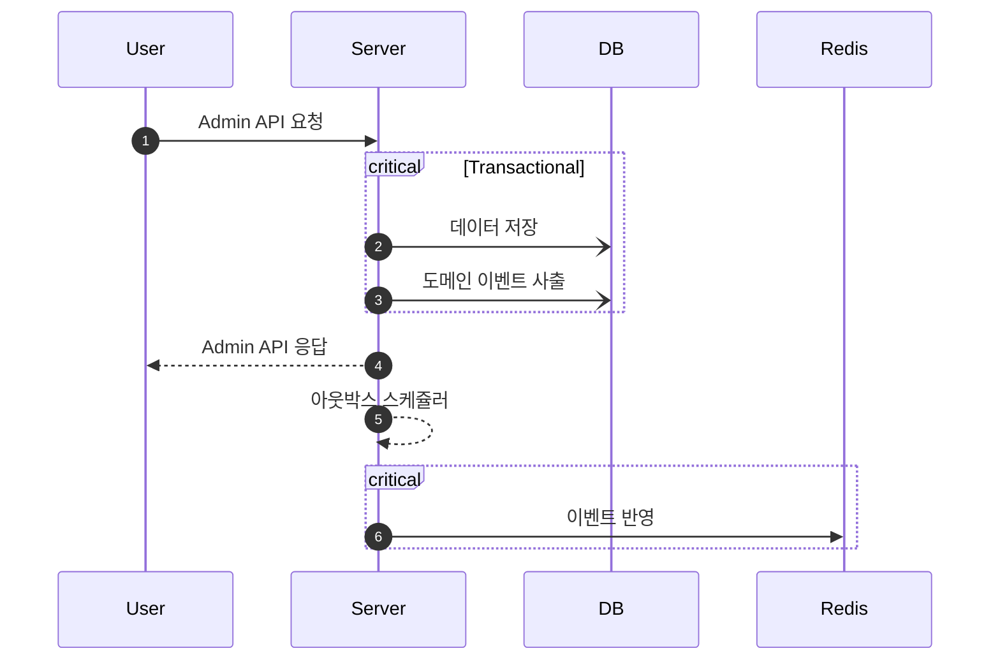
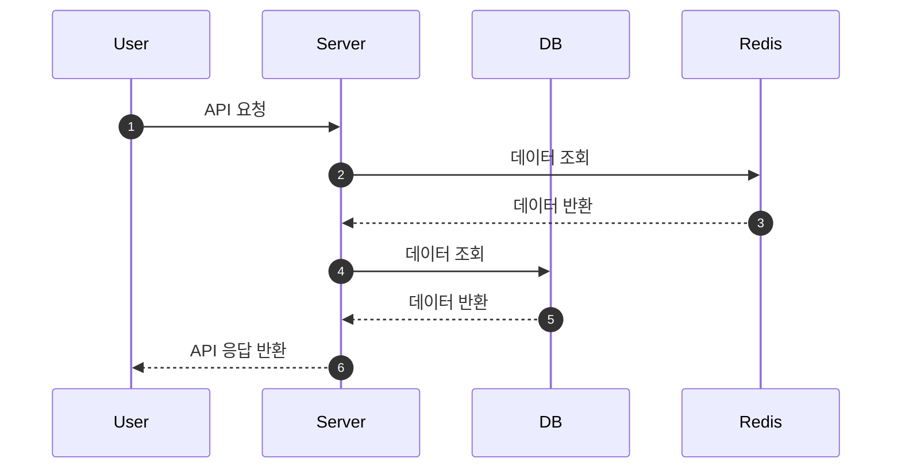
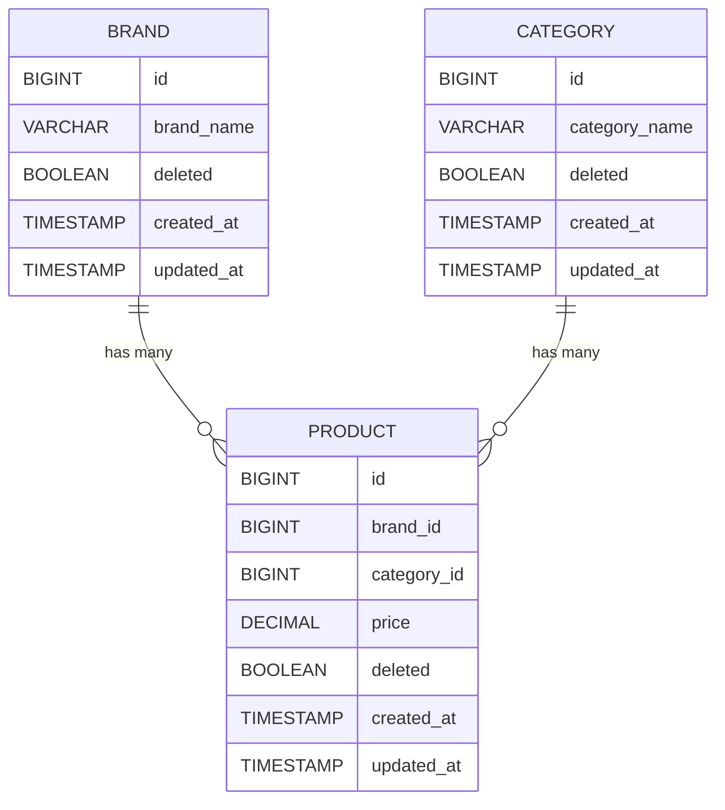

# **Musinsa Project**

무신사 Java(Kotlin) Backend Engineer 과제

---

## 💡 **소개**
- 무신사 Java(Kotlin) Backend Engineer 과제 입니다.
- 코드에 대한 설명은 주석으로 기재 했습니다.
- 4가지의 구현 항목 모두 구현 되어 있습니다. 
- 저장소 2개를 분리하여, 각각 독립적으로 관리 될 수 있게 구현 하였습니다.

## 동작 기전 설명

### Admin API


### User API


### ERD


---

## 🚀 **설치**
### 환경
- Java 17
- Kotlin 1.9.25
- H2 DB
- Redis
- Docker
- Flyway

### 설치 및 실행 단계
1. 클론:
   ```bash
   git clone https://github.com/altaehom/MusinsaProject.git
   ```
2. H2 DB 설치
    ```
   http://h2database.com/html/main.html
    ```
3. Docker Compose 실행
    ```bash
   docker compose up -d
    ```
4. Project 실행
5. Flyway 확인

### 접속 정보
- H2 DB
    - Driver: org.h2.Driver
    - JDBC URL: jdbc:h2:tcp://localhost/~/test
    - 사용자명: sa
    - 비밀번호:
- Redis
    - Host: 127.0.0.1:56321
- LocalServer
  - URL : http://localhost:8080

### Postman Collection
```
src/main/resources/Musinsa Project.postman_collection.json
```

---

## 📋Init Data 실행
- H2 DB와 Redis를 사용함에 따라, 2개의 저장소에 데이터가 필히 존재해야, 기능이 동작하게 됩니다.
- 별도의 Init Script를 사용하지 않고, IT 테스트를 이용하여 Local DB, Redis에 데이터를 적재 합니다.

### 실행 방법
1. gradlew 이용
    ```bash
    ./gradlew clean test
    ```
2. It Test 직접 실행
    ```
    src/test/kotlin/com/musinsa/project/InitDataIntegrationTest.kt
    ```